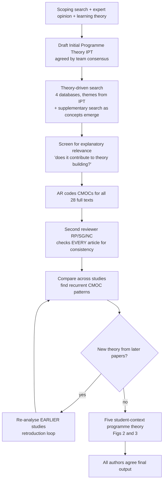
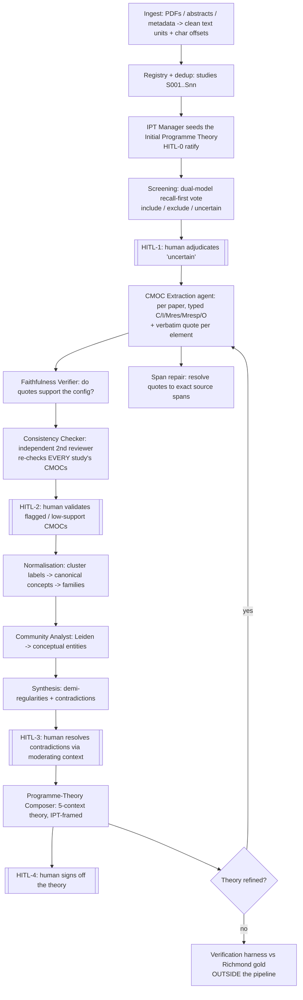

> **Historical document - September 2026 audit supersedes performance and implementation claims below.** Read `docs/research/RESEARCH_AUDIT_STATUS.md`, `docs/research/RICHMOND_OFFICIAL_FINDINGS.md`, and `docs/research/METHOD_AND_VERIFICATION_PROTOCOL.md` from the repository root. Old AI judgments are not completed human validation.

# The Workflow — Richmond's Human Process and Our System's Process, Side by Side

_A single, complete reference: (A) exactly how Richmond and colleagues worked to produce their realist
review, (B) exactly how our multi-agent system works, agent by agent, (C) how each system agent maps
to a human role, and (D) how we know the machine is working. Companion to
`RICHMOND_WORKFLOW_AND_AGENT_MAPPING.md` (deep grounding) and `ENTITY_RELATIONSHIP_EVALUATION.md`._

---

## Part A — Richmond's human workflow (how five experts made the paper)

Grounded in Richmond et al. (2020) §2 + Author Contributions (L649–658).

**The human conventions that matter (and that we copy):** domain-expert team (all clinical-reasoning
teachers); one lead coder + an independent second checker on *every* article; the theory is *seeded
first* and *refined iteratively* (retroduction); two consensus gates (IPT at the start, final output
at the end). Richmond leaves **normative judgement to humans** — the method externalises the analytic
labour, not the interpretation.

---

## Part B — Our system's workflow (the pipeline, stage by stage)

**Data layer:** PostgreSQL is the single source of truth (studies, text units, screening, CMOCs,
entities, relations, communities, contradictions, theory, HITL feedback, audit log, token usage). The
Literature Knowledge Graph is exported as canonical parquet and mirrored to Neo4j for exploration.
Every typed edge carries provenance `{study, text_unit, char span, verbatim quote, model, prompt
version, confidence}` — so any claim traces back to a sentence in a paper.

---

## Part C — The agents: who does what, and the human role each mirrors

Defined in `config/agents.yaml`; each carries an **expert persona** (domain + realist-method
expertise) that is prepended to its prompts (the MetaGPT principle: expertise lives in the role).

| # | Agent (model tier) | What it does | Mirrors in Richmond |
|---|---|---|---|
| 1 | **IPT Manager** (gpt-5.5) | Seeds + refines the Initial Programme Theory from public learning theory; never from Richmond's answers | AR + team building the IPT before analysis (L171–188) |
| 2 | **Screening Reviewer** (gpt-5.4-mini + gpt-4.1-mini, dual vote) | Recall-first include/exclude/uncertain on theory-relevance | AR screening + reviewer sample-check (L232–234) |
| 3 | **CMOC Extractor** (gpt-5.5) | Per paper, extracts typed C/I/Mres/Mresp/O with a verbatim quote each | AR's initial CMOC coding of all 28 (L248–250) |
| 4 | **Faithfulness Verifier** (gpt-5.4-mini) | Scores whether the quotes support each configuration | The team's "credible, trustworthy" bar (L235–236) |
| 5 | **Consistency Checker** (gpt-5.4 — *different family*) | Independently re-checks every study's CMOCs; flags over-claims to HITL-2 | "all 28 checked by another reviewer" (L248–250) |
| 6 | **Normaliser** (gpt-5.4-mini) | Clusters synonymous labels into canonical concepts + families | Recognising the same construct across studies (L251–253) |
| 7 | **Community Analyst** (gpt-5.4-mini) | Leiden community detection → names emergent conceptual entities | Recurrent cross-study mechanism patterns (the professor's named novelty) |
| 8 | **Synthesis / Theory Composer** (gpt-5.5) | Demi-regularities, contradictions, and the 5-context programme theory | AR synthesising + articulating the theory (L262–264) |
| — | **Human (HITL-0…4)** | Sovereign at 5 checkpoints: IPT, screening, CMOC validation, contradictions, theory sign-off | The five authors' consensus authority (L178–188, L657–658) |

Run `res agents` to print this roster live.

---

## Part D — How we know it works (effectiveness evidence)

Effectiveness is measured **outside the pipeline** against Richmond's published outputs (the gold
standard is read only by the verification harness, never by the agents — proven anti-contamination):

- **Screening:** 100% sensitivity after HITL-1 (recovers all 28); 76% specificity on a 100-paper
  distractor pool (discriminates, not just recalls).
- **Extraction fidelity:** 96.3% of claims quote-anchored to source; 99.4% of relations pass
  type validation.
- **Entity coverage:** 80.9% of Richmond's 47 gold entities recovered (majority-vote, post-retroduction).
- **Relation recovery:** 97.5% at causal-pattern level (the realist-appropriate measure); 10% strict.
- **Community↔mechanism alignment:** 42.9% of Richmond's mechanisms captured by emergent Leiden
  communities.
- **Programme-theory correspondence:** ~0.60 (model-judged; human rating still required).
- **Per-agent health:** each agent logs tokens + an audit event; the Checker's disagreement rate
  (56%) is itself a quality signal routing weak CMOCs to human review.

All LLM-judged metrics are sampled 3× and majority-voted/averaged with a reported range, so no single
noisy run is presented as fact. Deterministic metrics (screening, faithfulness, type validity) are
stable across runs.

**In one sentence:** the system performs Richmond's five realist operations as explicit computational
steps, coordinated by eight expert-persona agents around four human checkpoints, and is independently
verified to reproduce Richmond's causal structure at high fidelity — with human judgement sovereign,
exactly as realist methodology requires.
